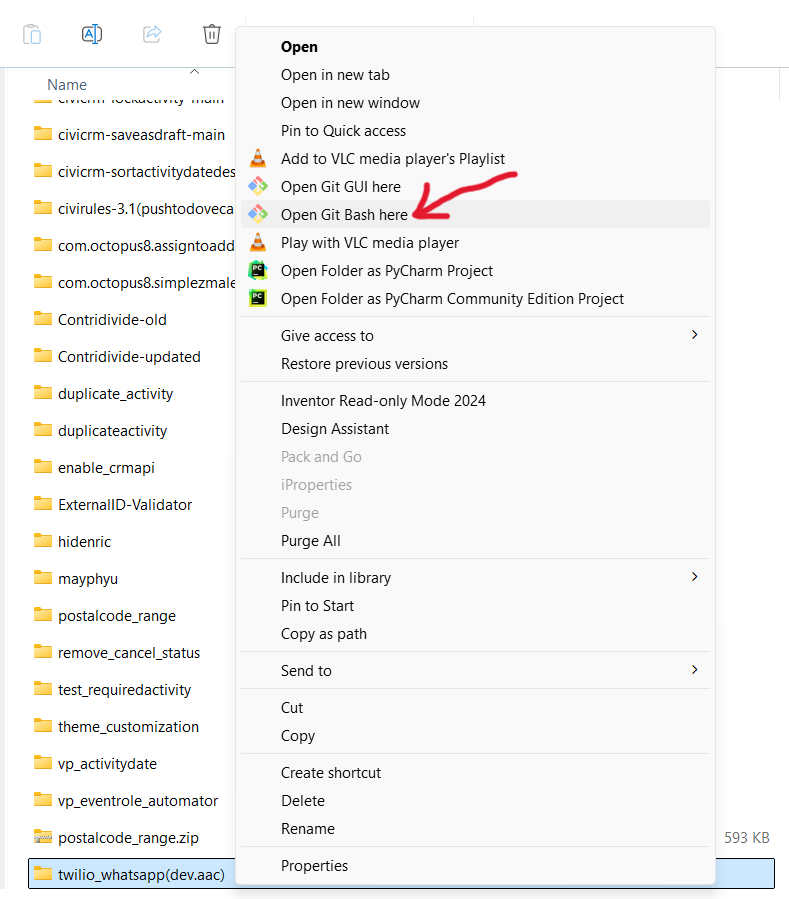
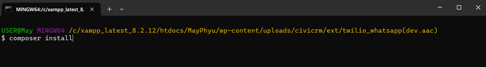
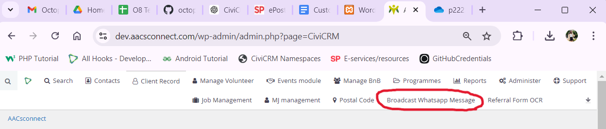
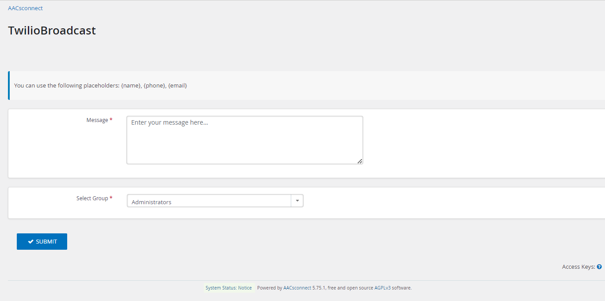

# twilio_whatsapp

# Best way to download
If you do not want to make any changes mentioned above, go to https://dev.aacsconnect.com/wp-admin/admin.php?page=CiviCRM and download the “twilio_whatsapp” extension. 

# Objective
To allow the use of Twillio's API to broadcast messages to our contacts.

# Overview
- The Twilio Whatsapp Extension is developed to send Whatsapp Broadcast Messages to contacts within a group.

- Users are able to use placeholders such as "{phone},{name},{email}" 

# Installation
- Download the extension and extract the file
- Right click the extracted file and click “Show more options”. Then, click “Open Git Bash here”.

- Then, run ‘“composer install’’’ to download the dependencies

- Enter your Twilio Account Keys in “CRM/TwilioWhatsapp/Form/TwilioBroadcast.php” line 71 and 72
- Upload the file into your extension folder

# How to use
After installing and enabling the extension,
1. Click “Broadcast Whatsapp Message” in CiviCRM menu bar.

2. Write a message and select the contact group.

3. Press ‘Submit’.

4. Only contacts who has messaged our business account, will receive your message. If they have not messaged previously, it will not be sent. This is due to a security and privacy feature on Whatsapp's end.

The extension is licensed under [AGPL-3.0](LICENSE.txt).
